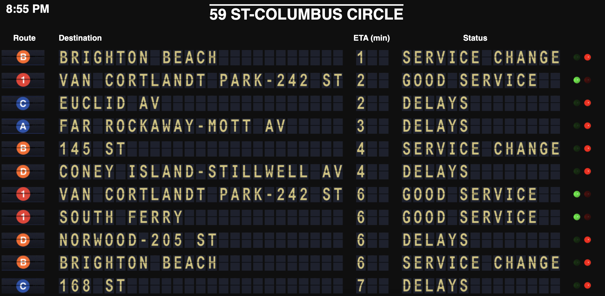
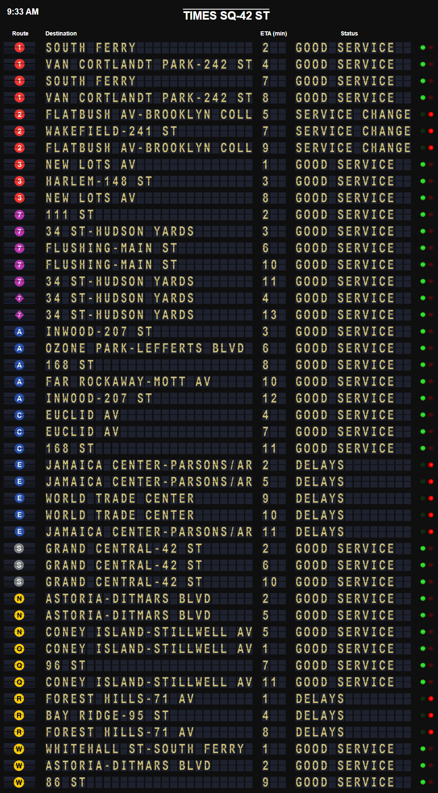

# Virtual Split-Flap Display

This is a simulation of a split-flap display (often called a Solari board) designed to run locally in a web browser. It dynamically loads JSON data from the MTA data feeds and renders that data as characters and images on the board. Individual characters are animated using CSS sprites.

This board is fully configurable by changing the markup and using different sprite images, and the included files can help you get started if you wanted to emulate NYC Subway data, or your own project. The board can be run on a vertical or horizontal monitor. You may want to change the number of rows loaded and data to pull depending on your needs. 

This project utilizes the split flap template from [baspete's project](https://github.com/baspete/Split-Flap/), and the Python code utilizes endpoints provided by [Transiter](https://github.com/jamespfennell/transiter)

## Running the Program
To run this version, edit the station code in the python file located on line 7. For example, the station code for 14th St-Union Sq is R20. Using R20 will give both north and south departures for this station. If you only want to display one direction, use 'R20S' or 'R20N'. You can use the stations.csv file to look up your station. When you're ready, run the Python file. It will run on a continuous loop, updating every 45 seconds until you end the program. You can adjust the cadence by changing the value on line 123 of the python code. 

When you've set that up, run the app.js file using node.js. 

Then, navigate to `http://locahost:8080` in your browser and you're good to go. Happy traveling! 

## Customization

This project is completely customizable to your preferences. You can adjust things like number of rows, refresh intervals, sorting by time or route, and much more. 

Some examples:
Number of rows: To adjust the number of rows, change the value in line 30 within the app.js file, and lines 109 & 112 in index.html. 

Sort order: To change the sorting format, change lines 110/111 in index.html. This is helpful if you have a station with a lot of different train lines, like Times Square:

Refresh interval: Change line 123 in the Python file and line 23 in app.js

## Demo

I have set up a temporary demo of this application [here](https://splitflap.glitch.me/). As each users screen size may be different, you can zoom in/out in the browser to fit your screen. There are enough rows loaded to run this vertically as well. You may experience lagging on some older mobile devices. If you experience lagging with your own project, you can adjust the 'stagger' time in index.html, or editing the refresh speed of other elements.
